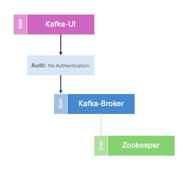

# Simple Kafka Deployment



A single-instance Kafka setup for local testing/development. Uses Zookeeper, Kafka, and Kafka UI.  
**No encryption**, **no authentication**.

## Prerequisites
- [Docker](https://docs.docker.com/get-docker/)
- Docker Compose v2+
- (Optional) [Make](https://www.gnu.org/software/make/)

## Quick Start
1. **Start:**
   ```bash
   make run
   ```
   - Spins up Zookeeper, Kafka, and Kafka UI.
2. **Stop/Clean:**
    ```bash
    make clean
    ```
    - Stops and removes all containers.


# Details
- **Ports Exposed:**
    - Kafka: `9092`
    - Zookeeper: `2181`
    - Kafka UI: `8089` → [http://localhost:8089](http://localhost:8089)
- **Environment Variables:**<br />
Managed in the `.env` file, referenced by `docker-compose.yml`.<br />
Example `.env`:
```env
ZOOKEEPER_IMAGE=confluentinc/cp-zookeeper:7.7.0
KAFKA_IMAGE=confluentinc/cp-kafka:7.7.0
KAFKA_UI_IMAGE=provectuslabs/kafka-ui
```
- **Logging:**
```bash
docker compose logs -f kafka
```
Replace `kafka` with `zookeeper` or `kafka-ui` to view other logs.