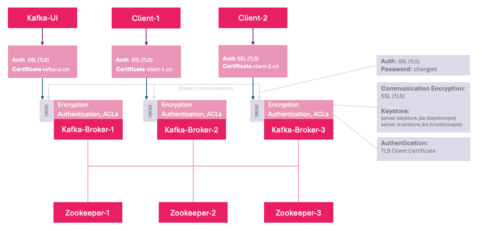

# Kafka Cluster with TLS Encryption


A clustered Kafka setup for local testing/development on a single vm. Uses Zookeeper, Kafka, and Kafka UI.  
* **SSL (TLS) Encryption**
  * Mutual TLS for Client Authentication
  * Kafka ACL Authorizer

## Prerequisites
- [Docker](https://docs.docker.com/get-docker/)
- Docker Compose v2+
- (Optional) [Make](https://www.gnu.org/software/make/)
- Java keytool

## Quick Start
1. **Start:**
   ```bash
   make run
   ```
   - Generates all TLS certs in `certs` folder with keystore password `changeit`
   - Spins up Zookeeper, Kafka, and Kafka UI.
2. **Stop/Clean:**
    ```bash
    make clean
    ```
    - Stops and removes all containers

# Details
- **Ports Exposed**:
  - Kafka (SSL): `19093` `29093` `39093`
  - Zookeeper: `2181`
  - Kafka UI: `8089` -> [http_//localhost:8089](http_//localhost:8089)
- **Environment Variables**:<br />
  Managed in the `.env` file, references by `docker-compose.yml`.<br />
  Example `.env`:
  ```
  ZOOKEEPER_IMAGE=confluentinc/cp-zookeeper:7.7.0
  KAFKA_IMAGE=confluentinc/cp-kafka:7.7.0
  KAFKA_UI_IMAGE=provectuslabs/kafka-ui
  ```
- **Authentication Configuration**:
  - **Kafka UI**<br />
  Provide kafka ui user with the necessary privileges to manage the cluster
  ```
  # Give Kafka-UI full access to all topics
  docker exec -it kafka-1 kafka-acls --authorizer-properties zookeeper.connect=zookeeper-1:2181 \
    --add --allow-principal "User:kafka-ui" --operation All --topic '*'

  # Allow Kafka-UI full access to the Kafka cluster
  docker exec -it kafka-1 kafka-acls --authorizer-properties zookeeper.connect=zookeeper-1:2181 \
    --add --allow-principal "User:kafka-ui" --operation All --cluster

  # restart kafka ui
  docker restart kafka-ui
  ```
  - **Client 1**<br />
  In the same manner, permit the other users using the ACL