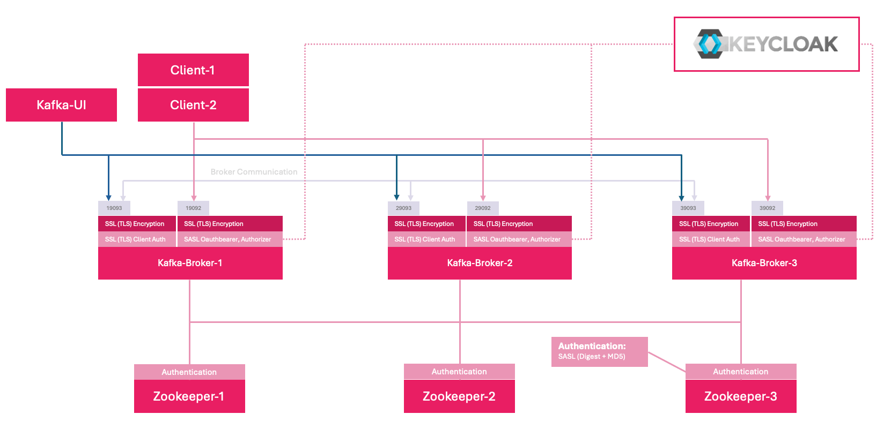

# Kafka Cluster with Enterprise Authentication


A clustered Kafka setup with oauth enterprise authentication and authorization for local testing/development on a single vm. Uses Zookeeper, Kafka, and Kafka UI.  Requires a keycloak server

* **SSL (TLS) Encryption**
  * Mutual TLS for Client Authentication
  * Oauth Authentication and Authorization (Strimzi Plugins)

## Prerequisites
- [Docker](https://docs.docker.com/get-docker/)
- Docker Compose v2+
- (Optional) [Make](https://www.gnu.org/software/make/)
- Java keytool

## Quick Start
1. **Start:**
   ```bash
   make run
   ```
   - Generates all TLS certs in `certs` folder with keystore password `changeit`
   - Spins up Zookeeper, Kafka, and Kafka UI.
2. **Stop/Clean:**
    ```bash
    make clean
    ```
    - Stops and removes all containers

# Details
- **Ports Exposed**:
  - Kafka (SASLSSL): `19092` `29092` `39092`
  - Kafka (SSL): `19093` `39093` `39093`
  - Zookeeper: `2181`
  - Kafka UI: `8089` -> [http_//localhost:8089](http_//localhost:8089)
- **Environment Variables**:<br />
  Managed in the `.env` file, references by `docker-compose.yml`.<br />
  Example `.env`:
  ```
  KAFKA_SUPER_USERS=User:kafka;User:kafka-ui;User:admin
  ```
